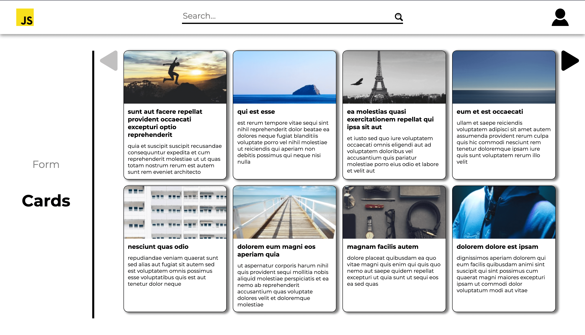

# CicekSepeti-Homeworks

This repository contains several homeworks that I made during CicekSepeti React Bootcamp.

In this readme file, you can find used technologies and images of websites.

<h2>First Homework</h2>

Used Technologies:

<ul>
  <li>HTML</li>
  <li>SASS</li>
  <li>JavaScript</li>
  <li>Netlify for hosting</li>
</ul>
<b>Live version:</b> You can access the website from <a href="https://ciceksepeti-bootcamp-hw1.netlify.app/">here</a>.
<h3>Images of website</h3>

<h2>Second Homework</h2>

Used Technologies:

<ul>
  <li>HTML</li>
  <li>SASS</li>
  <li>JavaScript</li>
  <li>Webpack-Babel-Eslint</li>
  <li>Netlify for hosting</li>
</ul>
<b>Live version:</b> You can access the website from <a href="https://ciceksepeti-bootcamp-hw2.netlify.app/">here</a>.
<h3>Images of website</h3>

<h2>Third Homework</h2>

Used Technologies:

<ul>
  <li>React</li>
  <li>SASS</li>
  <li>Express</li>
  <li>MongoDB</li>
  <li>Heroku for hosting</li>
</ul>
<b>Live version:</b> You can access the website from <a href="https://ciceksepeti-bootcamp-hw3.herokuapp.com/">here</a>.
<h3>Images of website</h3>

